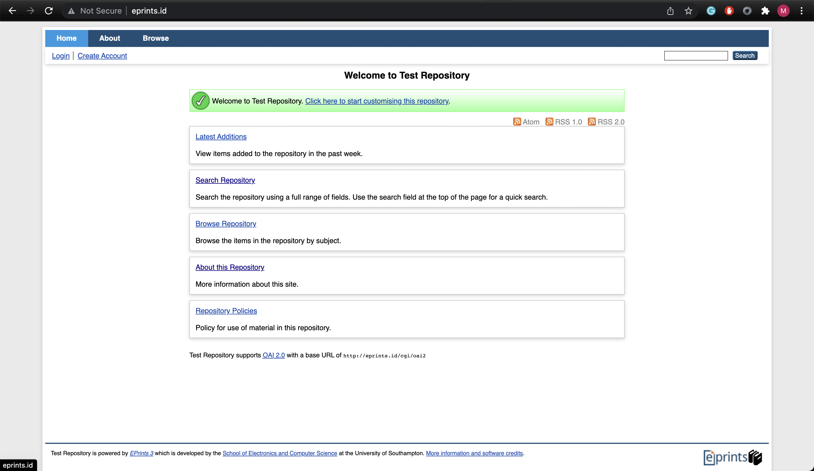

#### EPrints docker Setup

##### Prerequisites

STEP 1: RUN Makefile

The make command build the docker image.

```
make
```

STEP 2: Check the Docker image

```
docker images
```

STEP 3: RUN the docker image

```
docker run -p 80:80 eprints
```

STEP 4: Open in browser

```
eprints.id
```

Below the EPrints home page


